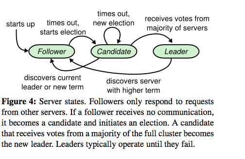

Table of Content
===============
* [Raft](#raft)
    * [Features](#features)
    * [Paxos](#paxos)
    * [Design](#design)
    * [Configuration](#configuration)
    * [Log Compaciton](#log-compaciton)
    * [Implementation Details](#implementation-details)
  * [Fault Tolerance:](#fault-tolerance)
    * [At least once](#at-least-once)
      * [What it means?](#what-it-means)
      * [What is bad?](#what-is-bad)
    * [At most once](#at-most-once)
      * [What it means?](#what-it-means-1)
      * [What is this "at most once"?](#what-is-this-at-most-once)
      * [What can be the issues of it?](#what-can-be-the-issues-of-it)
* [GFS](#gfs)
    * [Design](#design-1)
    * [Consistency](#consistency)
    * [System](#system)
    * [Record Append](#record-append)
    * [Snapshot](#snapshot)
    * [Master](#master)

## Raft

#### Features

**What are the properties of Raft concensus algorithm?** (p1-R)

> 1. Strong leadership 
>    - unlike Paxos, it is not a protocal based on peer to peer concensus  
> 2. Membership changes 
>    - it allows configuration changes without down time through Join Consensus 
> 3. Leader election 
>    - randominized algorithm in electing a leader

#### Paxos

**What are the two drawbacks of Paxos**

> 1. Difficult to understand 
> 2. No guideline in concrete implementation 

#### Design

**What is the general approach of Raft, in terms of consensus algorithm, and what are the problems arrived from it?**

> Leader based.
>
>  Porblems: 
>
> 1. leader election
> 2. log replication 
> 3. Safety 

**What are the three roles a server can play?**

- Leader
- Follower
- Candidate 

**How does Raft prevent inifinite election**

> It is possibel to have split votes. In this situation, Raft adopts a random election timeout so that candidates will initiate election at different time interval so that it is more likely one early candidate will receive the votes from majority before others initiate election as well

**What are the the alternative leader election algorithm being considered**

> fixed ranking of each server. A low-rank server reverts back to follow once discovered a higher-rank candidate
>
> 
>
> Problem: 
>
> A low-rank will need to timeout to become a candiadate when a high rank server failed. But if it does too soon, it will reset other current candidate's progress.
>
> Many other corner cases

**When is a log committed?**

> When a leader decideds to commit an entry to its own state machine, and this will take place once the leader has replicated the log on a majority of the server​
>
> This committed entry info will be included in the future AppendEntries RPC, when the follower will learn if it should apply the committed the log to its state machine

**What are the log matching properties, and how are they maintained?**

> It is part of the State Machine Safety Property. 
>
> It states that if two logs contain an entry with the same term at the same index, then all log entries up to this entry in both logs are identical. 
>
> It is maintained inductively with the PreviousLogTerm and PreviousLogIndex check when appending entries.

**How does a newly elected leader continue replication?** 

> Leader never commits entries from previous terms even though a majority has replicated it. It will continue replicating entries not committed in its own log, and commit those in the current term once majority has replicated them. 
>
> Those entries from the previous terms will be eventually committed indirectly due to the State Machine Safety Property

**What is the difference between a log being replicated vs committed?** 

> Replicated: added to one server's log
>
> Committed: majority of servers have it added. The leader should have apply the entry to its own state machine. A committed entry is durable. 

**How is timing a concern in the design? (5.6)**

> In particular, the time of message passing << election timeout << failure restart time

#### Configuration

**How to dynamically update the cluster? (6.9)**

> Join concensus, from  C{old} to C{old, new} to C{new} 

**What are the three issues in updating configuration (6, p 11) **

> 1. Reliability 
> 2. Safety 
> 3. ​

#### Log Compaciton

**Why the last incldued index/term is needed for snapshotting? (p12L) **

**Why is snapshotting deviant from Raft's principle in strong leadership? And how is it not siginificant? (p12 R)**

**Why is a ledaer-oriented snapshotting algorithm not preferred ? (p13L) **

#### Implementation Details

**Leader election**

> 1. timeout 
> 2. vote for itself 
> 3. request votes from others 

### Fault Tolerance:

#### At least once

##### What it means?

> Client keeps trying until receives confirmation or throws failure 

##### What is bad?

> Doesn't work for non-indempotent operations. (But work for operatoins such as read)

#### At most once

##### What it means?

> Server is in charge of detecting duplicate requests by "keeping track of the requests ID (XID)"

##### What is this "at most once"?

> Because sometimes, the client and the server may "agree" to skip the request, depending on how the server and the client deals with the duplicates

##### What can be the issues of it?

> - What if XID duplicates?
>   - Per client address
> - How long to keep track of the XID info?
>   - only allowing sliding window of 1
>   - after X retries / X minutes from the client?
> - What if the early duplicate still in process?
> - What if server crashed and the duplicates info stored in memory? 

## GFS

#### Design

Why large chunk size good / bad? How is it optimized?

> Good: 
>
> - minimize interaction with master 
>
> Bad: 
>
> - hot spot possible
>
> Optimization: 
>
> - lazy allocation 

How does an applciation interact with master/chunkmaster to init connections?

> 1. Client requests the master with file name and chunk index
> 2. Master mapps the chunk index to the replicas, and create a chunk handler
> 3. Master gives back the client the chunkserver to call for, and chunk handler 
> 4. Client makes connection with the chunkserver

What information does master store

> - chunk namespace (persistent)
> - mapping: name <-> chunk  (persistent) 
> - location of each chunk's replica

#### Consistency

What is a record append, and how is it different from the normal append?

> It is atomic, and also at the end of the chunk file. 

When stale data might be read? 

> when the chunkserver of a replica is down, and it missed the mutation. However, the client still reads from it. 

What does it mean for Applications to adopt the semantics? 

#### System

How is mutation applied across multiple replicas? 

> Some mutation lease that is given to the primary replica, after confirmation from the various secondary replicas.
>
> And the primary replica will determine a serialized sequence of mutations, and propogate the change to secondary.

How is mutaiton made?

> - Client requests server for mutation, and master responds with mutation lease and primary and secondary replica's locations. 
> - Client starts pushing data 
> - Once all confirmed receive the data, server starts to make mutation requests to the primary. 

What is the mutation lease? 

> A token passed to the primary replica for determining mutations serial sequence from multiple clients

How does the primary determine the serial number winthin one lease grant?

> some its own semantics

How does the data flow?

> From linear rather than tree topology. Meaning transmitting all the data to the nearest, and once the nerarest chunkserver starts receiving, it also starts sending. 

#### Record Append

What is record append, and what's it for? 

> It allows concurrent mutations from multiple clients on the same file

How is this implemented? 

> Similar to normal mutation. Only that a check on the chunk size assuming mutation will be made beforehand. 
>
> at-least-once semantics of appending

What will happen if one replica fails at record append? 

> The records at different replica might be different. (Some might have duplicated records appended)

#### Snapshot

How is it implemented?

> COW like AFS

Why to expire the current leases? 

> need to force the chunkservers to get another lease so that master can implement COW on the new chunk.

#### Master

How is stale chunks detected and prevented?

> Used the chunk version number, which is incremented everytime when a new lease is given out

