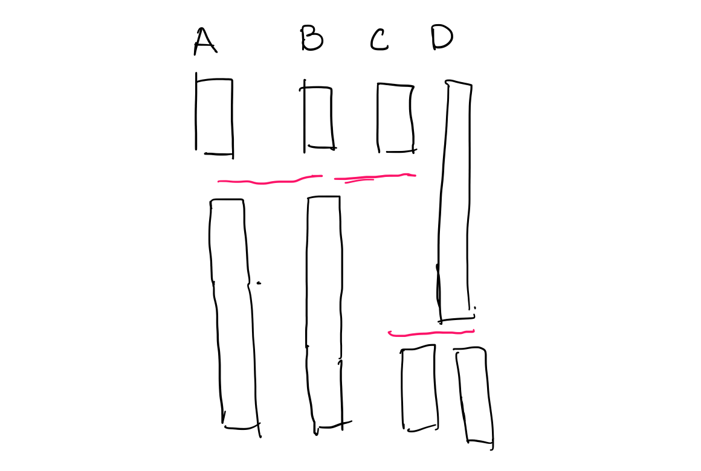

# Java Parallelism Notes

    * [1\. RecrusiveAction (Regular Parralell Task, Project 1)](#1-recrusiveaction-regular-parralell-task-project-1)
      * [How to use?](#how-to-use)
    * [2\. RecursiveTask &lt;T&gt; (Project 2)](#2-recursivetask-t-project-2)
    * [3\. Parrallel Stream (project 3)](#3-parrallel-stream-project-3)
    * [4\. Parrallel loops (project 3)](#4-parrallel-loops-project-3)
      * [4\.1 Chunking](#41-chunking)
    * [5\. Barriers and Phasers (Project 4)](#5-barriers-and-phasers-project-4)
      * [5\.1 Idea of tiering](#51-idea-of-tiering)
      * [5\.2 Split\-phase barriers:](#52-split-phase-barriers)
      * [5\.3 Split arrive and await barriers:](#53-split-arrive-and-await-barriers)
      * [5\.5 Fuzzy phase barriers for granular control](#55-fuzzy-phase-barriers-for-granular-control)
      * [5\.6 Pipelining](#56-pipelining)
    * [6\. Future tasks](#6-future-tasks)


#### 1. RecrusiveAction (Regular Parralell Task, Project 1)

##### How to use?

```java
/*
 * MyRA class represents a task that will compute part of the data 
 * in parrallel with each on multi-cores.
 */
class MyRA extends RecursiveAction {
  //initialize data to be processed: 
  private final int[] data;
  private final int startIdx;
  private final int endIdx; 
  
  //value holder to be retrieved later on
  private int value;
  
  MyRa(int[] _data, int s, int e){
    this.data = _data; this.startIdx = s; this.endIdx = e;
    this.value = 0;
  }
  
  @Override
  protected void compute(){
    	//logic to compute given the data 
    	for(int i = startIdx; i < endIdx; i++)
          value += data[i];
  }
  
  public int getValue(){ return this.value;}
}


/*
 * This class acts as a master that breaks a huge task into chunks
 * And then give to multiple MyRA to compute
 */
class SomeParrallelTaskManager{
  private final int[] data;
  
  SomeParrallelTaskManager(int[] data){
  	  this.data= data;
  }
  
  public int doParrallelWork(Config config){
	
    MyRA[] tasks = new MyRA[config.numTasks];
    for(int i = 1; i<tasks.length ; i++)
      tasks[i].fork();
    
    tasks[0].compute();
    
    for(int i = 1; i<tasks.length; i++)
      tasks[i].join();
    
    int result = 0;
    for(int i = 0; i<tasks.length; i++){
      	result += tasks[i].getValue();
    }
    
    return result;
  }
}
```


#### 2. RecursiveTask \<T> (Project 2)

- Implemented the `java.concurrent.Future` interface
- Different from `RecursiveAction` , its `join()` also returns the asyncrhonous computed value. 
- There are effieciency differences in simplying calling `t.compute()` versus `t.fork(); t.join();`. The first version is preferred.

Therefore, instead of writing with `RecursiveAction`:

```java
class RA extends RecursiveAction {
  int sum;
	
  @Override
  protected void compute() {...}
  
  public int getValue()
}

class ParrallelCompute {
  static int doCompute(){
    RA task1 = new RA();
    RA task2 = new RA();
    
    task1.fork();
    task2.compute();
    
    task1.join();
    
	return task1.getValue() + task2.getValue();
  }
}
```


We can do the following: 

```java
class RT extends RecursiveTask<Integer> {
  //int sum; /* this is no longer needed */
	
  
  /* Notice the change of function signatures */
  @Override
  protected Integer compute() {...} 
  
  // public int getValue() /* this as well */
}

class ParrallelCompute {
  static int doCompute(){
    RA task1 = new RA();
    RA task2 = new RA();
    
    task1.fork();
    return task2.compute() + task1.join();
    
    /* The sequence matters here. 
     * This is actually bad? Since compute only starts after join returns. 
     */
    //return task1.join() + task2.compute();
  }
}
```


#### 3. Parrallel Stream (project 3)

- Using parrallel stream API to do computation without explicit looping and intermediate collections/data structure. (Under the API abstraction, iteration has been taken care of)
- It is extremely fitting with the idea of functional programming where elements flow from states (stages) to states

❗️When using concurrent Collectors such as `groupingByConcurrent`,  be cautious of the collected data structure needs to be Concurrent as well, e.g. `ConcurrentHashMap`


#### 4. Parrallel loops (project 3)

​	It could be implemented using parrallel streams: 

```java
IntStream.rangeClosed(1, 100).parallel().filter().map().collect()....
```


​	Of couse, using the APIs provided by [PCDP](https://habanero-rice.github.io/PCDP/edu/rice/pcdp/PCDP.html) it could be done using a simple `forAll` loop:

```java
forAll(i:[0,N]) {
  doSomething(i); //this function with i will be invoked in parrallel with the other N invocations
}
```


##### 4.1 Chunking 

Sometimes we also want to limit the parrallelism to a certain factor, for example, by the number of cores or certain level of resources. We could achieve this by grouping or chunking the entire tasks space into several smaller groups/chunks. 

There are 2 common ways of chunking, cyclic and block. 

(Where k = number of groups, m = number of elements in a group, km = total size:N)

1. cyclic: 

   group 0: [0, k, 2k….(m-1)k]

   group 1: [1, k+1, 2k+1 .. ]

   ….

   group k-1: [k-1, k+(k-1), 2k+(k-1), ...]

   ​

2. block:

   group 0: [0, 1, 2, … m-1],

   group 1: [m, m+1, ….. 2m-1],

   ….

   group k-1: [(k-1)m, …. km-1]

   ​

```java
//blocking
forAll(g: [0: k]){
  for(int i = 0; i < m; i++){
    sum += data[g*k + i];
  }
}

//cyclic
forAll(g: [0: k]){
  for(int i = 0; i<m; i++){
    sum += data[mk+g];
  }
}
```


#### 5. Barriers and Phasers (Project 4)

In my understanding, Java phasers is similar to Golang's channel in parrallelism control. A phaser allows one to explicitly control the parallelism in multiple ways. 

Some basic operations of Phaser: 

1. `arrive() -> int` 

   it is similar to the concecpt of signal, indicating that some other tasks waiting for this threads's current phase could continue.

2. `awaitAdvance(int) -> int`

   simiar to wait, meaning the current thread should be blocked while waiting for this phaser to reach the paramerter phase stage. And it should return the next phase stage.

   this method will only return once all the parties of this phaser has reached the stage.

3. `register()`

   a registration will add a party to the phaser. 


##### 5.1 Idea of tiering

​	Sometimes, instead of having a phaser registered with a large of parties, while it is not necessory that all the parties must be syncrhonized with each other, it is a good idea to create a hierarchy of sub-phasers.

Parties registered to the same phaser should be scheduled interdependenly and process together stage by stage, but parties of different sub-phasers could be executed at different stages.


##### 5.2 Split-phase barriers:

​	A common pattern of parrallism among multilple tasks is that some phases of the the tasks can be executed in parrallel while at certain point of time, they all have to be syncronized. A computation graph of such pattern might be: 


It could be implemented using a barrier: 


```java
Phaser ph = new Phaser(0);

ph.bulkRegister(N);

forall(i: [1 : N]){
  for(int stage = 0; stage < totalStages ; stage++){
    compute(stage);
    
    ph.arriveAndAwaitAdvance(); // wait for all the tasks to reach stage in each iterations.
    
	doSync(); /* something that only could be done after syncing among all tasks. 
		       * for example updating some data structures or swap pointers? */
    
  }
}
```


##### 5.3 Split arrive and await barriers:

​	Sometimes, for some tasks, there are local work which are independent of others, and there are computation that would be visible to others. It will be a good idea to notify others as soon as the shared portion of computation is done, so others will not be blocked. And at the same time, the waiting period could be done in parrallel with the local computation. 

```java
/* Syncing with others first */
singalAndWait() // wait for others to be done to get a consistent value of A in the next get()
localCompute() 
A = get()
processA()

/* Syncing with others afterwards */
localCompute()
signalAndWait() 
A = get()
processA()


```

​	In either case, the local computation is not relevant to the sync of A value. And if localCompute takes 100 units of computation, and syncing of A takes other 100 (probably because you have to first signal some other threads to compute on A, and pass the value to you). The whole process will take at least 200.

​	So what if you can first signal to other threads, and while you are waiting for the result, you could actualy do the local computation. (Thinking of it as an analogy of emailing your mom to prepare for dinner while you are watching a movie, rather then tell you mom and wait for dinner and then watch a movie, or watch a movie and then tell your mom and wait for dinner)

​    

```java
int p = ph.arrive();
localCompute();
ph.awaitAdvance(p);
```

The localcompute and the waiting process can be executed parrallel, reducing the critical path less than 200. (Ideally 100)


##### 5.5 Fuzzy phase barriers for granular control

Parralism could be futher improved with a fuzzy phaser, a more granular controlled phaser instead of a singleton one for all the parrallel tasks executing. This is especially the case where there are data dependecies between only a subset of the tasks. Taking the below computation graph as an example: 


In this case, each neighboring tasks have data dependency. It has to wait for the neighboring tasks to finish the current iteration before it can proceed with the next iteration. However, in fact, a task could proceed to the next iteration as long as is neighbors have finished the current iteration. In this case, a task does not need to spend useless waiting time on tasks that it does not depent on.




```java
Phaser[] phs = new Phaser[numTasks];

for(Phaser ph : phs){
  //register with one party
  ph = new Phaser(1);
}

forall(i : [0, numTasks-1]){
  for(int s = 0; s < steps; s++){
    preSetup();
    doSharedJob();

    // Indicate arrival to tasks depending on it
    int arrival = ph[i].arrive(); 
    
    doLocal();
    
    // Wait for its dependency
    if(i > 0) phs[i-1].awaitAdvance(arrival);
    if(i < numTasks-1) phs[i+1].awaitAdvance(arrival);
    
    //Set up next iteration
    postSetup();
  }
}
```


##### 5.6 Pipelining 

Pipelining some tasks is another parrallism pattern that could be implemented by Phaser. 

```java
Phaser[] phs = new Phaser[pipes];

for(Phaser ph : phs) ph = new Phaser(1);

forall(i : [0:k]){
  threads[i] = new Thread(()->{
    while(hasInput()){
      //wait for the previous pipes
      if(i > 0) phs[i-1].awaitAdvance(iter);
      else iter++;
      
      doWork();
      
      phs[i].arrive();
    }
  });
  
  thread[i].start();
}


```


#### 6. Future tasks 

Java does not have a official package on this data flow pattern, the idea is to create async task that specifies its data dependency at declaratio, so that tasks will get triggered as the data flows between dependencies. 

Assuming we have an API: 

```java
asyncAwait(A, ()->{/* Task waiting on event A */});
asyncAwait(A, B, ()->{/* Task waiting on event A, B */});
asyncAwait(C, ()->{/* Task waiting on event C */});

async(()->{/* Dp something */; A.put()}); //A.put() signals the A event 
async(()->{/* Do something */; B.put(); C.put()})
```

This idea of data flow parrallel pattern is better implemented by Javascript ' s Promises, and await/async.


